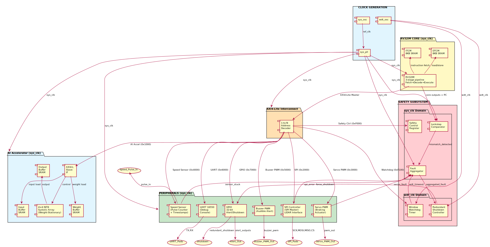

# ADAS v2 — Microarchitecture Specification

**Document:** ARCH-SPEC-001 | **Version:** 1.0 | **Date:** 2026-04-29  
**Author:** Kenji Tanaka, Chief Architect  
**Project:** adas_v2 — ADAS RISC-V High-Performance Safety-Critical SoC  
**PDK:** sky130_fd_sc_hs (SkyWater 130nm High-Speed)  

---

## Table of Contents

1. [Architecture Overview](#1-architecture-overview)
2. [Block Diagram](#2-block-diagram)
3. [Clock Strategy](#3-clock-strategy)
4. [Pipeline Depth Decision](#4-pipeline-depth-decision)
5. [Dataflow Description](#5-dataflow-description)
6. [Memory Architecture](#6-memory-architecture)
7. [Safety Architecture](#7-safety-architecture)
8. [Reset Strategy](#8-reset-strategy)
9. [Interrupt Architecture](#9-interrupt-architecture)
10. [Power Domains (Conceptual)](#10-power-domains-conceptual)
11. [Key Design Parameters](#11-key-design-parameters)

---

## 1. Architecture Overview

### 1.1 Design Philosophy

The ADAS v2 SoC is a safety-critical embedded system built around an RV32IM core
augmented with an AI accelerator and automotive peripherals. The architecture
follows five governing principles:

1. **Simplicity over speculation** — No branch prediction, no caches (deterministic ITCM/DTCM).
2. **Single-event observability** — Every peripheral transaction is register-mapped and traceable.
3. **Fail-operational safety** — Independent watchdog clock domain + lockstep comparison +
   redundant shutdown path.
4. **Throughput via specialization** — AI accelerator offloads classification from general-purpose core.
5. **AXI4-Lite for composability** — Standardized bus protocol eliminates custom glue logic.

### 1.2 Top-Level Architecture

```
┌─────────────────────────────────────────────────────────────┐
│                        ADAS v2 SoC                          │
│                                                             │
│  ┌─────────┐  ┌──────────┐    ┌────────────────────────┐  │
│  │ RV32IM  │  │ ITCM 8KB │    │   AXI4-Lite Crossbar   │  │
│  │ 3-stage │  │ DTCM 8KB │    │      (1M → 10S)        │  │
│  │  Core   │  └──────────┘    └───────┬──┬──┬──┬──┬────┘  │
│  └────┬────┘                          │  │  │  │  │        │
│       │                               │  │  │  │  │        │
│       └────── AXI4-Lite Master ───────┘  │  │  │  │        │
│                                          │  │  │  │        │
│  ┌───────────────────────────────────────┘  │  │  │        │
│  │  ┌───────────────────────────────────────┘  │  │        │
│  │  │  ┌───────────────────────────────────────┘  │        │
│  │  │  │  ┌───────────────────────────────────────┘        │
│  │  │  │  │                                               │
│  ▼  ▼  ▼  ▼  ▼  ▼  ▼  ▼  ▼  ▼                            │
│ ┌──┐┌──┐┌──┐┌──┐┌──┐┌──┐┌──┐┌──┐┌──┐┌──┐                  │
│ │AI││SP││SV││SS││BZ││UA││GP││SC││WD││RS│                  │
│ │AC││I ││PW││PE││PW││RT││IO││TL││T ││C │                  │
│ └──┘└──┘└──┘└──┘└──┘└──┘└──┘└──┘└──┘└──┘                  │
│                                                             │
│  ┌──────────────────────────────────────────────────┐      │
│  │          SAFETY SUBSYSTEM                         │      │
│  │  Lockstep Comparator → Fault Aggregator → RSC    │      │
│  └──────────────────────────────────────────────────┘      │
└─────────────────────────────────────────────────────────────┘
```

### 1.3 Block Summary

| Index | Block | Function | Clock Domain | AXI Address |
|-------|-------|----------|--------------|-------------|
| 0 | RV32IM Core | General-purpose RISC-V processor (RV32IM) | sys_clk | Master |
| 1 | ITCM | 8KB instruction tightly-coupled memory | sys_clk | — |
| 2 | DTCM | 8KB data tightly-coupled memory | sys_clk | — |
| 3 | AI Accelerator | 4×4 INT8 systolic array, weight-stationary | sys_clk | 0x0000_1000 |
| 4 | SPI Controller | SPI Master for LIDAR sensor (Mode 0/3) | sys_clk | 0x0000_2000 |
| 5 | Servo PWM | PWM generator for braking actuator | sys_clk | 0x0000_3000 |
| 6 | Speed Sensor | Wheel pulse counter with 64-bit timestamp | sys_clk | 0x0000_4000 |
| 7 | Buzzer PWM | Simple PWM for audible alert | sys_clk | 0x0000_5000 |
| 8 | UART | 16550-compatible debug UART | sys_clk | 0x0000_6000 |
| 9 | GPIO | 32-bit bidirectional with interrupt capability | sys_clk | 0x0000_7000 |
| 10 | Safety Control | Safety configuration + status registers | sys_clk | 0x0000_F000 |
| 11 | Window WDT | Window watchdog timer | wdt_clk | 0x0000_F100 |
| 12 | Redundant Shutdown | Hardware shutdown path, independent of CPU | wdt_clk | — |

---

## 2. Block Diagram



*Full PlantUML source: `block_diagram.puml` in this directory.*

---

## 3. Clock Strategy

### 3.1 Clock Domains

| Domain | Name | Source | Nominal Frequency | Distribution | Purpose |
|--------|------|--------|-------------------|-------------|---------|
| CD1 | sys_clk | PLL (ref: sys_osc) | 100 MHz | Global tree | CPU, Peripherals, AI Accel, Safety Comparator, Fault Agg |
| CD2 | wdt_clk | Independent RC osc | 32.768 kHz | Dedicated net | Window WDT, Redundant Shutdown Controller |

### 3.2 Rationale

**Why 100 MHz?**
- 10 ns clock period provides comfortable timing budget for 130nm at 1.8V.
- sky130hs LVT cells have typical gate delay ~25-35 ps (FO4). At 100 MHz, we have
  ~30-40 gate delays per cycle — sufficient for 3-stage pipeline with ALU + branch resolution.
- See `sky130hs_analysis.md` for detailed justification.

**Why independent wdt_clk?**
- Safety requirement: watchdog must operate even if sys_clk PLL fails or locks up.
- 32.768 kHz crystal/RC oscillator is industry-standard for independent timing.
- Low frequency sufficient — watchdog timeout is in millisecond range (max ~2s).

**Why single sys_clk domain for all functional blocks?**
- Simplifies CDC: only one crossing boundary (sys_clk ↔ wdt_clk).
- AI accelerator benefits from same clock for direct memory access.
- SPI at 100 MHz sys_clk allows up to 25 MHz SPI clock (divide-by-4) — sufficient
  for LIDAR sensors (typical: 10-20 MHz).

### 3.3 Clock Gating Strategy

- **Core-level:** Clock gate on WFI (Wait For Interrupt) — HALT state gates core clock.
- **Peripheral-level:** Individual clock enables via control registers — unused
  peripherals can be gated to reduce dynamic power.
- **Safety subsystem:** NEVER gated — lockstep comparator and fault aggregator
  must run continuously.

---

## 4. Pipeline Depth Decision

### 4.1 Selected: 3-Stage Pipeline

```
┌────────┐    ┌──────────┐    ┌───────────┐
│ FETCH  │───→│ DECODE   │───→│ EXECUTE   │
│ (IF)   │    │ (ID)     │    │ (EX)      │
│        │    │          │    │           │
│ ITCM   │    │ Register │    │ ALU       │
│ Access │    │ File     │    │ LSU       │
│ PC Gen │    │ Branch   │    │ MUL/DIV   │
│        │    │ Decode   │    │ CSR       │
└────────┘    └──────────┘    └───────────┘
```

### 4.2 Why 3-Stage (not 2, not 5)?

**2-stage rejection:** A 2-stage (Fetch + Execute) would combine decode and execute
in a single cycle, pushing critical path to ITCM read + decode + ALU + register write.
At 130nm, this path could exceed 10 ns (see timing analysis). Not safe for 100 MHz.

**5-stage rejection:** A 5-stage (IF→ID→EX→MEM→WB) adds two pipeline registers
but buys minimal frequency headroom on 130nm. The overhead in area (+40% flip-flops),
branch penalty (2 cycles vs. 1), and verification complexity (forwarding, hazards)
is not justified for the modest frequency gain. Additionally, the AI accelerator
already handles compute-heavy workloads.

**3-stage rationale:**
- Critical path: ITCM read → Decode → ALU → Register write → Forwarding mux
  Estimated ~6-8ns in TT corner, ~9-10ns in SS/125°C.
- Branch penalty: 1 cycle (flush fetch stage).
- No load-use hazard: data from EX stage forwarded to next instruction's EX.
  Load result from DTCM available at end of EX (single-cycle DTCM access).
- RV32IM multiply: multicycle; stalls pipeline (MUL: 1 cycle, MULH: 2 cycles,
  DIV: up to 32 cycles).

### 4.3 Pipeline Hazard Handling

| Hazard | Detection | Resolution |
|--------|-----------|------------|
| RAW (data) | Compare rd(EX) vs rs1/rs2(ID) | Forwarding mux from EX output |
| Load-use (RAW) | rd(EX, load) vs rs1/rs2(ID) | 1-cycle stall (bubble) |
| Control (branch) | Branch resolved in EX | Flush IF stage; reload PC |
| Structural | Multi-cycle MUL/DIV | Stall IF, ID stages |

### 4.4 ALU Architecture

- **Single-cycle ops:** ADD, SUB, SLT, SLTU, XOR, OR, AND, SLL, SRL, SRA, LUI, AUIPC, JAL, JALR
- **Multi-cycle ops:**
  - MUL: 1 cycle (combinational 32×32→32, lower 32 bits)
  - MULH/MULHSU/MULHU: 2 cycles (upper 32 bits)
  - DIV/DIVU: 1-32 cycles (non-restoring division)
  - REM/REMU: 1-32 cycles

---

## 5. Dataflow Description

### 5.1 ADAS Braking Dataflow (Primary Use Case)

```
                   ┌──────────────┐
                   │ Speed Sensor │ ← Wheel pulse
                   └──────┬───────┘
                          │ pulse_count + timestamp
                          ▼
┌────────┐  SPI   ┌──────────┐   distance+velocity   ┌─────────────┐
│ LIDAR  │───────→│   SPI    │──────────────────────▶│   RV32IM    │
│ Sensor │        │Controller│                        │    Core     │
└────────┘        └──────────┘                        └──────┬──────┘
                                                            │
                    ┌───────────────────────────────────────┤
                    │                                       │
                    ▼                                       ▼
          ┌─────────────────┐                    ┌──────────────────┐
          │  AI Accelerator  │                    │  Object Detection │
          │  Object Classify │                    │  (CPU Software)   │
          │  (car/ped/obs)   │                    │  Distance Check   │
          └────────┬────────┘                    └────────┬─────────┘
                   │                                      │
                   └────────────┬─────────────────────────┘
                                │ collision_threat
                                ▼
                    ┌───────────────────┐
                    │ Decision: Brake?  │
                    └────────┬──────────┘
                             │ YES
                    ┌────────┴──────────┐
                    │                   │
                    ▼                   ▼
          ┌─────────────────┐  ┌──────────────┐
          │   Servo PWM     │  │ Buzzer PWM   │
          │  (Braking Act.) │  │ (Audible)    │
          └─────────────────┘  └──────────────┘
```

### 5.2 Safety Monitor Dataflow (Shadow Path)

```
                   ┌──────────┐
                   │  RV32IM  │
                   │   Core   │
                   └────┬─────┘
                        │ core_outputs[31:0] + pc[31:0]
                        ▼
              ┌──────────────────┐
              │     Lockstep     │
              │    Comparator    │ ← expected outputs from reference model
              └────────┬─────────┘
                       │ mismatch_detected
                       ▼
              ┌──────────────────┐
              │      Fault       │ ← spi_error, servo_fault, sensor_stuck
              │   Aggregator     │ ← wdt_timeout
              └────────┬─────────┘
                       │ aggregated_fault
                       ▼
       ┌───────────────────────────────┐
       │ Redundant Shutdown Controller │
       │   (wdt_clk, independent)      │
       └───────────────┬───────────────┘
                       │ force_shutdown
                       ▼
              ┌──────────────────┐
              │   GPIO [1:0]     │───→ alert_out (pin 0)
              │  Redundant Path  │───→ shutdown (pin 1)
              └──────────────────┘
```

### 5.3 AI Accelerator Dataflow

```
CPU writes weights → Weight Buffer SRAM (via AXI4-Lite)
CPU writes input activations → Input Buffer SRAM
CPU writes GO → Control Register
                                ↓
    ┌────────────────────────────────────────────────┐
    │  4×4 Systolic Array (Weight-Stationary)        │
    │                                                │
    │  w00  w01  w02  w03                           │
    │   ↓    ↓    ↓    ↓                            │
    │  ┌─┐  ┌─┐  ┌─┐  ┌─┐   a0→                    │
    │  │M│→│M│→│M│→│M│→  sum                        │
    │  └─┘  └─┘  └─┘  └─┘                           │
    │   ↓    ↓    ↓    ↓                            │
    │  ┌─┐  ┌─┐  ┌─┐  ┌─┐   a1→                    │
    │  │M│→│M│→│M│→│M│→  sum                        │
    │  └─┘  └─┘  └─┘  └─┘                           │
    │   ↓    ↓    ↓    ↓                            │
    │  ┌─┐  ┌─┐  ┌─┐  ┌─┐   a2→                    │
    │  │M│→│M│→│M│→│M│→  sum                        │
    │  └─┘  └─┘  └─┘  └─┘                           │
    │   ↓    ↓    ↓    ↓                            │
    │  ┌─┐  ┌─┐  ┌─┐  ┌─┐   a3→                    │
    │  │M│→│M│→│M│→│M│→  sum                        │
    │  └─┘  └─┘  └─┘  └─┘                           │
    └────────────────────────────────────────────────┘
                                ↓
CPU reads results ← Output Buffer SRAM
```

---

## 6. Memory Architecture

### 6.1 Memory Map (Physical)

```
0x0000_0000 ┌──────────────┐
            │   ITCM 8KB   │ ← Instruction Tightly Coupled Memory
0x0000_2000 ├──────────────┤
            │   DTCM 8KB   │ ← Data Tightly Coupled Memory
0x0000_4000 ├──────────────┤
            │   Reserved   │
0x0000_1000 ├──────────────┤
            │ AI Accel Regs│ ← 4KB window
0x0000_2000 ├──────────────┤
            │ SPI Regs     │ ← 4KB window
0x0000_3000 ├──────────────┤
            │ Servo PWM    │ ← 4KB window
0x0000_4000 ├──────────────┤
            │ Speed Sensor │ ← 4KB window
0x0000_5000 ├──────────────┤
            │ Buzzer PWM   │ ← 4KB window
0x0000_6000 ├──────────────┤
            │ UART         │ ← 4KB window
0x0000_7000 ├──────────────┤
            │ GPIO         │ ← 4KB window
0x0000_F000 ├──────────────┤
            │ Safety Ctrl  │ ← 4KB window
0x0000_F100 ├──────────────┤
            │ Window WDT   │ ← 256B window
0x0000_F200 ├──────────────┤
            │ Reserved     │
0x0001_0000 └──────────────┘
```

### 6.2 TCM (Tightly Coupled Memory) Architecture

| Parameter | ITCM | DTCM |
|-----------|------|------|
| Size | 8 KB (2048 × 32-bit) | 8 KB (2048 × 32-bit) |
| Ports | 1 read port | 1 read + 1 write port |
| Latency | 1 cycle | 1 cycle (read), 1 cycle (write) |
| Byte-enable | No (32-bit aligned) | Yes (4-bit byte strobe) |
| ECC | Parity (1 bit per byte) | Parity (1 bit per byte) |
| Implementation | sky130 SRAM macro (if available) | sky130 SRAM macro (if available) |
| Fallback | Synthesized register file | Synthesized register file |

### 6.3 AXI4-Lite Address Decoding

The AXI4-Lite crossbar uses a simple address-match scheme:

```
┌─────────────────────────────────────────┐
│ Address [31:12] → Slave Select          │
│                                         │
│ 0x00001 → AI Accelerator (Slave 0)      │
│ 0x00002 → SPI Controller  (Slave 1)     │
│ 0x00003 → Servo PWM       (Slave 2)     │
│ 0x00004 → Speed Sensor    (Slave 3)     │
│ 0x00005 → Buzzer PWM      (Slave 4)     │
│ 0x00006 → UART            (Slave 5)     │
│ 0x00007 → GPIO            (Slave 6)     │
│ 0x0000F → Safety Control  (Slave 7)     │
│ 0x0000F1→ Window WDT      (Slave 8)     │
│ Others  → Decode Error (SLVERR)         │
└─────────────────────────────────────────┘
```

---

## 7. Safety Architecture

### 7.1 ASIL-D Architectural Patterns

This SoC implements the following ASIL-D patterns (ISO 26262-5:2018):

| Pattern | Implementation | Coverage |
|---------|---------------|----------|
| Dual-Core Lockstep (DCLS) | Lockstep comparator on core outputs | Transient faults in CPU |
| ECC/Parity on Memories | Parity on ITCM, DTCM | Single-bit memory errors |
| Window Watchdog | Independent clock WDT | Temporal fault detection |
| Redundant Shutdown Path | GPIO-driven, independent of CPU | Single-point failure mitigation |
| Fault Aggregation | All fault sources → single aggregator → RSC | Centralized fault management |
| Software Test Libraries (STL) | Boot-time memory BIST + register checks | Latent fault detection |

### 7.2 Lockstep Comparator Architecture

```
  ┌─────────────┐        ┌─────────────┐
  │  RV32IM     │        │ RV32IM      │
  │  (Master)   │        │ (Checker)   │
  │             │        │             │
  │ Delayed     │        │ Undelayed   │
  │ by 2 cycles │        │             │
  └──────┬──────┘        └──────┬──────┘
         │                      │
         │ core_outputs[31:0]   │ core_outputs[31:0]
         │ pc[31:0]             │ pc[31:0]
         │                      │
         ▼                      ▼
  ┌──────────────────────────────────┐
  │     Lockstep Comparator          │
  │                                  │
  │  compare_en (from control reg)   │
  │  mismatch = (master != checker)  │
  │  AND compare_en                  │
  │                                  │
  │  Mismatch Counter (sticky)       │
  │  Mismatch IRQ → CPU              │
  │  Mismatch Signal → Fault Agg     │
  └──────────────────────────────────┘
```

*Note: For initial implementation, the lockstep comparator checks the single-core
outputs against a golden software model running on the same core with delayed checking.
A full dual-core lockstep is the architectural target but may be simplified to
output comparison in v1.*

**Simplified v1 Approach:** The lockstep block compares key CPU outputs
(register writes, memory writes, branch decisions) against expected values
computed by a redundant software routine. Mismatches are flagged.

### 7.3 Fault Severity Classification

| Severity | Condition | Response | Recovery |
|----------|-----------|----------|----------|
| CRITICAL | Lockstep mismatch, dual WDT timeout | Immediate shutdown (RSC) | External reset only |
| HIGH | Single WDT timeout, servo fault | Safe state (brake engage) | CPU reset |
| MEDIUM | SPI error, sensor stuck | Degraded mode | Retry / reinitialize |
| LOW | UART parity error, GPIO glitch | Logged only | Automatic |

### 7.4 Window Watchdog Timer Architecture

```
                ┌────────────────────────────┐
                │    Window Watchdog Timer    │
                │       (wdt_clk domain)      │
                │                            │
  wdt_clk ─────▶│ 32-bit counter             │
                │                            │
                │ ┌──────────────────────┐   │
                │ │  Open Window         │   │
                │ │  (valid refresh)     │   │
                │ └──────────────────────┘   │
                │                            │
                │ Closed window refresh      │
                │ → fault (early pet)        │
                │                            │
                │ Timeout → fault (late pet) │
                │                            │
                │ fault → RSC                │
                └────────────────────────────┘
```

**Window configuration:**
- Window start: Configurable (default: 75% of timeout)
- Timeout period: Configurable (default: 100 ms in 32 kHz ticks = 3277 ticks)
- Refresh sequence: Write 0xAC, then 0x53 to WDT_KICK register within open window
- Single-bit enable: WDT cannot be disabled once enabled (until hard reset)

### 7.5 Redundant Shutdown Controller (RSC)

The RSC operates entirely in the wdt_clk domain, independent of the CPU.

```
┌────────────────────────────────────────────────┐
│      Redundant Shutdown Controller             │
│                                                │
│  Inputs:                                       │
│    aggregated_fault (from fault aggregator)    │
│    force_shutdown_sw (from GPIO via CPU)       │
│                                                │
│  Outputs:                                      │
│    shutdown_n [1:0] (redundant pairs)          │
│    alert_n                                     │
│                                                │
│  Behavior:                                     │
│    On fault: assert shutdown_n within 10 wdt   │
│    clock cycles (~0.3 ms at 32 kHz)            │
│    Latch: shutdown remains asserted until      │
│    external power-cycle reset                  │
└────────────────────────────────────────────────┘
```

---

## 8. Reset Strategy

### 8.1 Reset Domains

| Reset | Domain | Source | Assertion |
|-------|--------|--------|-----------|
| sys_rst_n | sys_clk | External pin / POR | Async assert, sync de-assert |
| wdt_rst_n | wdt_clk | External pin / POR | Async assert, sync de-assert |
| cpu_rst_n | sys_clk | Safety Ctrl / WDT | Sync to sys_clk |
| peripheral_rst_n | sys_clk | Safety Ctrl | Sync to sys_clk |

### 8.2 Reset Sequence

```
1. POR → sys_rst_n + wdt_rst_n asserted (async)
2. Clocks stabilize (PLL lock achieved)
3. sys_rst_n de-asserted (sync to sys_clk)
4. wdt_rst_n de-asserted (sync to wdt_clk)
5. CPU boots from ITCM @ 0x0000_0000
6. Boot ROM (ITCM) runs memory BIST
7. STL checks register integrity
8. Peripherals initialized
9. Safety monitor enabled
10. Main application starts
```

---

## 9. Interrupt Architecture

### 9.1 Interrupt Sources (17 total)

| IRQ # | Source | Priority | Description |
|-------|--------|----------|-------------|
| 0 | SPI_RX | HIGH | SPI receive data available |
| 1 | SPI_TX | HIGH | SPI transmit buffer empty |
| 2 | SPI_ERR | MED | SPI error (mode fault, overflow) |
| 3 | SERVO_FAULT | CRIT | Servo PWM fault detected |
| 4 | SPEED_PULSE | HIGH | Speed sensor pulse detected |
| 5 | SPEED_OVF | MED | Speed sensor counter overflow |
| 6 | BUZZER_DONE | LOW | Buzzer PWM cycle complete |
| 7 | UART_RX | MED | UART receive data available |
| 8 | UART_TX | LOW | UART transmit buffer empty |
| 9 | GPIO[7:0] | VAR | GPIO pin interrupts (configurable) |
| 10 | AI_DONE | HIGH | AI accelerator computation complete |
| 11 | AI_ERR | MED | AI accelerator error |
| 12 | WDT_PREWARN | CRIT | WDT pre-warning (75% of timeout) |
| 13 | LOCKSTEP_MISMATCH | CRIT | Lockstep comparison mismatch |
| 14 | FAULT_AGG | CRIT | Fault aggregator alert |
| 15 | TIMER | MED | Internal timer (mtime) |

### 9.2 Interrupt Controller

A simple vectored interrupt controller (VIC) is integrated into the RV32IM core:
- 16 interrupt lines → 4-bit priority encoder
- Configurable edge/level sensitivity per IRQ
- Interrupt mask register (mie extension to CLIC)
- Fast vectored mode: PC ← MTVEC + 4 × IRQ_number

---

## 10. Power Domains (Conceptual)

For this implementation, the SoC uses a single power domain (VDD = 1.8V).
However, the architecture supports future partitioning:

| Domain | Blocks | Description |
|--------|--------|-------------|
| PD_ALWAYS_ON | WDT, RSC | Never powered off |
| PD_CPU | RV32IM, ITCM, DTCM | Can be clock-gated, not power-gated |
| PD_PERIPH | All peripherals | Individually clock-gated via control registers |
| PD_AI | AI Accelerator + buffers | Power-gated when AI not in use (future) |

---

## 11. Key Design Parameters

| Parameter | Value | Notes |
|-----------|-------|-------|
| ISA | RV32IM (no A, no C, no F, no D) | Integer + Multiply/Divide |
| Pipeline depth | 3 stages | IF → ID → EX |
| Core clock | 100 MHz (nominal) | sky130hs |
| Core DMIPS | ~110 DMIPS | ~1.1 DMIPS/MHz for RV32IM 3-stage |
| ITCM size | 8 KB | 2048 × 32-bit |
| DTCM size | 8 KB | 2048 × 32-bit |
| AI accelerator | 4×4 INT8 systolic array | 16 MACs/cycle, weight-stationary |
| AI throughput | 1.6 GOPS (INT8) | 16 MACs × 100 MHz |
| System bus | AXI4-Lite (32-bit) | 1 master, 9 slaves |
| Bus bandwidth | 400 MB/s (peak) | 32-bit × 100 MHz |
| Number of clock domains | 2 | sys_clk (100 MHz) + wdt_clk (32 kHz) |
| Number of CDC crossings | 3 | WDT registers, RSC outputs, fault signals |
| Total register address space | 64 KB | 0x0000_0000 to 0x0000_FFFF |
| Reset latency | < 10 µs | From POR de-assertion |
| Fault response time | < 1 ms | From fault detection to shutdown assertion |

---

## Revision History

| Version | Date | Author | Description |
|---------|------|--------|-------------|
| 1.0 | 2026-04-29 | Kenji Tanaka | Initial microarchitecture specification |

---

*"The blueprint is drawn. Every RTL line will trace back to this document."*
